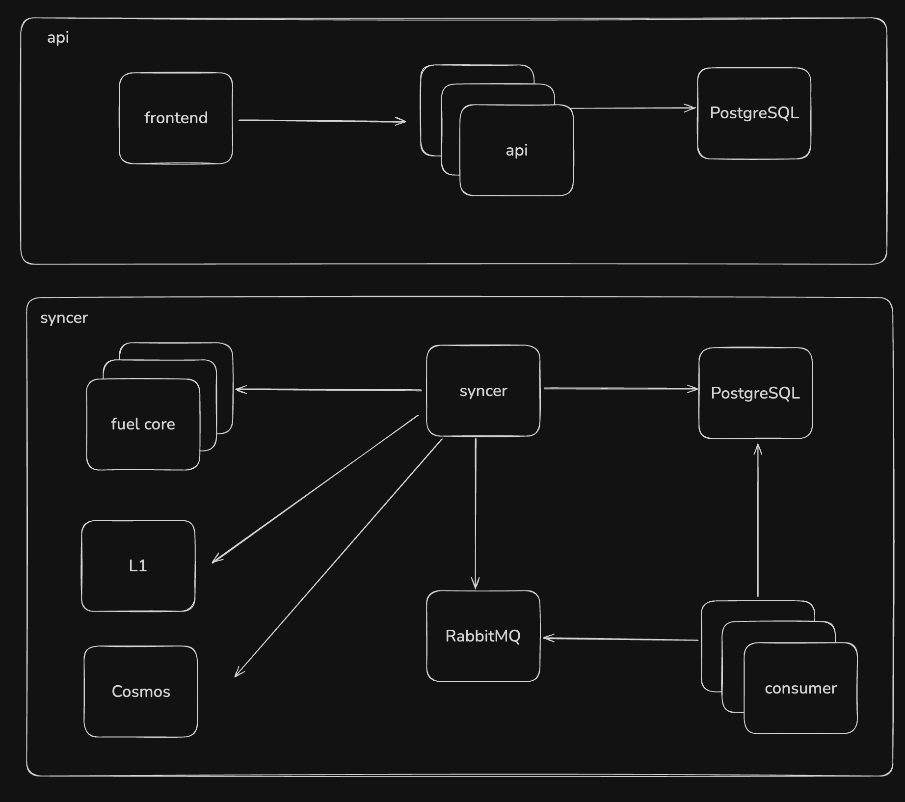

# Fuel Explorer Backend

This document provides a comprehensive overview of the Fuel Explorer Backend, covering its architecture details, installation steps, execution workflows, and ongoing maintenance procedures.

- [Introduction](#introduction)
    - [System Design](#system-design)
    - [Syncer Execution Flow](#syncer-execution-flow)
    - [API Execution Flow](#api-execution-flow)
    - [Public Endpoints](#public-endpoints)
- [Environment](#environment)
    - [Node](#node)
    - [PNPM](#pnpm)
    - [Docker Desktop](#docker-desktop)
    - [AWS CLI](#aws-cli)
    - [Kubernetes CLI](#kubernetes-cli)
    - [Lens](#lens)
- [Project Setup](#project-setup)
    - [Cloning Project](#cloning-project)
    - [Installing Dependencies](#installing-dependencies)
    - [Environment Variables](#environment-variables)
    - [Running the API](#running-the-api)
    - [Running Syncer with PM2](#running-syncer-with-pm2)
    - [Running the Database](#running-the-database)
        - [Using local database](#using-local-database)
        - [Using remote database](#using-remote-database)
    - [Syncing Blocks](#syncing-blocks)
    - [Password Management](#password-management)
- [Common Issues](#common-issues)
    - [Fuel Core endpoint is not available](#fuel-core-endpoint-is-not-available)
    - [Contract ABI is out of date](#contract-abi-is-out-of-date)
    - [NFT not being indexed](#nft-not-being-indexed)
    - [Wrong password on PostgreSQL or RabbitMQ](#wrong-password-on-postgresql-or-rabbitmq)
    - [Deadlock on database tables](#deadlock-on-database-tables)
- [Observability and Troubleshooting](#observability-and-troubleshooting)
    - [AWS Console](#aws-console)
    - [Logs](#logs)
    - [Metrics](#metrics)
    - [Alerts](#alerts)
    - [Bash access](#bash)
- [Deployment](#deployment)
    - [Flux](#flux)
        - [release.yaml](#releaseyaml)
        - [env-configmap.yaml](#env-configmapyaml)
        - [env-secrets.yaml](#env-secretsyaml)
    - [Helm Template](#helm-template)
        - [Chart.yaml](#chartyaml)
        - [values.yaml](#valuesyaml)
- [Maintenance Tasks](#maintenance-tasks)
    - [Stop services](#stop-services)
    - [Apply migrations](#apply-migrations)
    - [Process past data](#process-past-data)


## Introduction

The Fuel Explorer Backend serves two core functions:

API Provider for the Frontend:

It delivers a rich REST and GraphQL interface that exposes detailed data on blocks, transactions, inputs, outputs, contracts, predicates, accounts, and receipts. The API features robust pagination and aggregated endpoints tailored to power explorer charts and visualizations.

Blockchain Indexer & Data Processor:

It ingests and persists data from both L1 and L2 networks, then enriches it by computing account balances, tracking NFT ownership, supporting bridge and staking workflows, converting asset values to USD, and performing other crucial transformations—ensuring the frontend receives fully processed, ready-to-use information.

### System Design



### Syncer Execution Flow

The syncer continuously polls Fuel Core for the latest block height and compares it against the highest height already indexed. Whenever there’s a gap, it publishes RabbitMQ messages in batches of ten blocks. Six consumer instances then dequeue these messages, fetch each full block from Fuel Core, extract all relevant data—transactions, inputs, outputs, contracts, predicates, and receipts—and write them into the database.

Meanwhile, supporting side‐processes run in parallel to:

* Index L1 and Cosmos networks
* Calculate and update account balances
* Persist up-to-date exchange rates
* Execute periodic jobs (for example, rebuilding materialized views)

### API Execution Flow

The API layer runs eight stateless instances behind a load‐balancer, each handling incoming frontend requests by querying the database for the required data. When traffic spikes, a Kubernetes replica set automatically scales the number of pods in the cluster to maintain performance and availability.

### Public Endpoints

Here are the environment-specific endpoints:

```
https://explorer-indexer-devnet.fuel.network
https://explorer-indexer-testnet.fuel.network
https://explorer-indexer-mainnet.fuel.network
```

## Environment

To run the backend locally, ensure you have Node.js, PNPM, Docker, AWS CLI, Kubernetes CLI or Lens installed and configured. Other dependencies like PostgreSQL and RabbitMQ will be provisioned via Docker.

### Node

In production we are using Node.js 20, to install:

```
brew install node@20
```

or, use NVM to have more flexibility:

```
curl -o- https://raw.githubusercontent.com/nvm-sh/nvm/v0.39.3/install.sh | bash
nvm install 20
nvm use 20
```

### PNPM

The project uses pnpm, a high-performance Node.js package manager that hard-links dependencies from a global content-addressable store into isolated node_modules, drastically reducing disk usage, preventing phantom packages, and speeding up installs.

To install pnpm:

```
npm install -g pnpm
```

or, if you’re on Node.js v16.9+ with Corepack enabled:

```
corepack enable
corepack prepare pnpm@latest --activate
```

### Docker Desktop

To install Docker Desktop on OSX, download the installer on Docker's website:

```
https://docs.docker.com/desktop/setup/install/mac-install
```

### AWS CLI

To install AWS CLI on OSX use the command:

```
brew install awscli
```

After that you need to login to the AWS account:

```
aws configure sso --profile fuel-dev

SSO session name (Recommended): fuel-dev
SSO start URL [None]: https://fuelsh.awsapps.com/start
SSO region [None]: us-east-1
SSO registration scopes [sso:account:access]: sso:account:access
Attempting to automatically open the SSO authorization page in your default browser.
If the browser does not open or you wish to use a different device to authorize this request, open the following URL:

https://device.sso.us-east-1.amazonaws.com/

Then enter the code:

XXXX-YYYY
```

You'll be prompted to open the AWS SSO and login using you Fuel account. After successfully login, you need to select the account, be sure to select the correct one, where the cluster environment is running. In general we use 3 accounts: devnet (249945542445), testnet (533267304813), mainnet (767398027608).

Remember to always login before use Kubernetes CLI, otherwise it's gonna show an error.

### Kubernetes CLI

To install Kubernetes CLI on OSX use the command:

```
brew install kubectl
```

Since kubectl is just a client for the Kubernetes API, you must configure its context and credentials for the specific environment you’ll be working in (e.g. dev, testnet, or mainnet) before running any commands:

```
aws eks update-kubeconfig --name fuel-dev-2 --region us-east-1 --profile fuel-dev
aws eks update-kubeconfig --name fuel-prod-testnet --region us-east-1 --profile fuel-dev
aws eks update-kubeconfig --name fuel-prod-mainnet --region us-east-1 --profile fuel-dev
```

Always identify which namespace to use since namespace naming isn’t standardized and can vary by environment, so always verify the exact namespace before running any commands:

```
kubectl get namespaces
```

This error means that you are logged in one account and pointing your kubectl config to the wrong cluster:

```
Unhandled Error err=couldn't get current server API group list: the server has asked for the client to provide credentials
```

Use this command to identify which cluster are available in the account:

```
aws eks list-clusters --profile fuel-dev
```

### Lens

Alternatively, you can use a GUI tool like Lens to explore your cluster’s configuration, though it may not support every advanced operation.

```
https://k8slens.dev
```

## Project Setup

### Cloning Project

To get started, clone the repository by running:

```
git clone https://github.com/FuelLabs/fuel-explorer
```

Because our codebase is organized as a monorepo with multiple projects, the backend’s working directory is located at:

```
packages/graphql
```

### Installing Dependencies

Once you’ve cloned the repository, install all dependencies by running:

```
pnpm install
```

### Environment Variables

You’ll need to configure numerous environment variables, and their values will differ depending on how you run the project—whether against a local database or via RabbitMQ.

```
FUEL_PROVIDER: fuel core endpoint
SERVER_PORT: backend port
SERVER_API_KEY: backend api key
DB_HOST: database host
DB_PORT: database port
DB_USER: database user
DB_PASS: database password
DB_NAME: database name
RABBITMQ_HOST: rabbitmq host
RABBITMQ_PORT: rabbitmq port
RABBITMQ_USER: rabbitmq user
RABBITMQ_PASS: rabbitmq password
QUEUE_CONCURRENCY: amount of processes that rabbitmq use to consume queue
SSL: enable SSL on database and rabbitmq
DEBUG: debug mode
```

Recommend get the .env file with other team member.

### Running the API

First, build the project from the root directory:

```
pnpm build:prod
```

To run you can use the script or running the file directly:

```
pnpm run-start
```

or

```
npx tsx src/app.ts
```

### Running Syncer with PM2

In production environment we are using PM2 to manage Node.js processes. You don't need to use it locally, however, depending on the task you need to perform could be easier to use PM2 to start processes like syncer, consumer, api and other.

```
pnpm dev:syncer
```

### Running the Database

First step is to run the explorer locally and there are different strategies to do that:

#### Using remote database

If you just need to create a new endpoint, return more informations from database or even change the payload, sometimes is easier to just point to the devnet or testnet database and run the backend with this database, otherwise you will need to sync blocks manually in order to have data to implement and testing.

In order to use the remote database, you need to make a port-forward on the Kubernetes cluster. Please check the correct namespace on the cluster.

```
kubectl port-forward deploy/db-proxy-explorer 5432 -n <namespace>
```

You need to use the cluster configuration on .env file:

```
DB_HOST="127.0.0.1"
DB_PORT=5432
DB_USER=explorer
DB_PASS=<password>
DB_NAME=explorer
```

Remember to avoid using index commands on remote database, unless you know what you are doing.

#### Using local database

This approach is recommended when you need to add or modify index behavior or analyze problems with this process.

First you need to start the database on Docker:

```
docker compose up fuel_explorer_pgsql -d
```

You need to use the local configuration on .env file:

```
DB_HOST="127.0.0.1"
DB_PORT=5435
DB_USER=postgres
DB_PASS=postgres
DB_NAME=postgres
```

Apply the migrations by running the setup tool:

```
pnpm setup:backend
```

### Syncing blocks

By running the local database you need to sync blocks:

```
npx tsx src/sync-block-range 2000000 2000010
```

### Password Management

The password are kept in BitWarden or could be requested directly to the DevOps team.

## Common issues

### Fuel core endpoint is not available:

Fuel Core can become unavailable due to cluster network issues, leading to sync failures and API errors from missing chain data. If this occurs, first verify Fuel Core’s status by checking the logs or running a curl request from within the cluster. Then escalate to DevOps with your findings so they can diagnose and restore connectivity.

### Contract ABI is out of date:

Occasionally a contract’s ABI will change, which can break event synchronization. Logs will pinpoint the affected contract; to resolve the issue, update its ABI. Once corrected, event processing will automatically resume from the block where it stopped.

### NFT not being indexed:

Thunder collections use a dedicated metadata configuration mechanism—unlike the Fuel Network NFT standard, which relies on LOG_DATA events. As a result, we need to define the collection’s URL pattern so we can correctly extract its metadata and insert it into the collection table.

### Wrong password on PostgreSQL or RabbitMQ

We’ve previously run into issues where service passwords were changed but not updated in the Fuel Explorer service’s env-secrets.yaml, causing authentication failures.

### Deadlock on database tables

Be cautious when running heavy queries—especially ALTER TABLE statements—as they can lock the entire table and lead to application downtime. If you detect a lock or performance degradation, immediately cancel the query and use an alternative approach (for example, an online schema-change tool or rolling migration) to make your schema changes.

## Observability and Troubleshooting

### AWS Console

You can monitor resources like PostgreSQL directly in the AWS Console, just search for “RDS” and select the explorer database. We’re running Aurora RDS v2, which is fully elastic: it automatically scales under heavy load and exposes detailed charts for metrics like CPU utilization, I/O, and slow queries.

### Logs

Logs can be accessed in OpenSearch at the following endpoint:

Devnet:

```
https://grafana-fuel-prod-2.fuel.network
username: admin
password: <password>
```

Testnet:

```
https://search-fuel-prod-testnet-trl5zlea2v7wvzy57ggryh6uqm.us-east-1.es.amazonaws.com/_dashboards
username: fuel-elastic
password: <password>
```

Mainnet:

```
https://search-fuel-prod-mainnet-ca-qix4o6twktwywwjdqueqxz2umy.ca-central-1.es.amazonaws.com/_dashboards
username: fuel-elastic
password: <password>
```

You can also stream the pod’s logs directly from its stdout by running the following command:

```
kubectl logs pod -n namespace
```

### Metrics

Grafana offers intuitive, real-time dashboards that visualize key metrics:

Devnet:

```
https://grafana-fuel-dev-2.swayswap.io
username: admin
password: <password>
```

Testnet:

```
https://grafana-fuel-prod-testnet.fuel.network
username: admin
password: <password>
```

Mainnet:

```
https://grafana-fuel-prod-mainnet-ca.fuel.network
username: admin
password: <password>
```

Check the password for OpenSearch and Grafana on https://github.com/fuelLabs/fuel-deployment-v2

### Alerts

We’ve set up both PagerDuty and a dedicated Slack integration to ensure immediate visibility—and rapid response—whenever our sync process fails. The alerts are triggered based on exported metrics:

Devnet:

```
https://explorer-indexer-devnet.fuel.network/metrics
```

Testnet:

```
https://explorer-indexer-testnet.fuel.network/metrics
```

Mainnet:

```
https://explorer-indexer-mainnet.fuel.network/metrics
```

### Bash

At times, you'll need to inspect running processes or run local tests (for example, with curl). To get a shell inside the pod, run:

```
kubectl exec -it pod -n namespace -- /bin/bash
```

### RabbitMQ Admin Access

This section documents how to access the RabbitMQ admin interface for the Fuel indexer infrastructure, particularly useful for debugging sync issues or inspecting message queues.

#### Prerequisites

- Access to the Kubernetes cluster via `kubectl` or Lens
- AWS Secrets Manager access for credentials

#### Credentials

RabbitMQ credentials are stored in AWS Secrets Manager:

**Secret Location:** [AWS Secrets Manager - indexer-mq-user-password](https://us-east-1.console.aws.amazon.com/secretsmanager/secret?name=indexer-mq-user-password&region=us-east-1)

#### AMQPS Endpoint

```
amqps://b-02e7b94c-4870-40d6-83f9-33e3edf20a13.mq.us-east-1.amazonaws.com:5671
```

#### Access Steps

##### 1. Create an Ubuntu Debug Pod

Create a simple Ubuntu pod in your target namespace. Reference: [Ubuntu Sleep Pod YAML](https://downey.io/notes/dev/ubuntu-sleep-pod-yaml/)

Example pod manifest:

```yaml
apiVersion: v1
kind: Pod
metadata:
  name: ubuntu-debug
spec:
  containers:
  - name: ubuntu
    image: ubuntu:latest
    command: ["sleep", "604800"]  # Sleep for 1 week
```

Apply to your namespace:

```bash
kubectl apply -f ubuntu-pod.yaml -n <namespace>
```

##### 2. Exec into the Pod

```bash
kubectl exec -ti <pod-name> /bin/bash -n <namespace>
```

##### 3. Install rabbitmqadmin

Inside the pod, download and set up rabbitmqadmin:

```bash
apt-get update && apt-get install -y curl python3
curl -O https://raw.githubusercontent.com/rabbitmq/rabbitmq-server/main/deps/rabbitmq_management/bin/rabbitmqadmin
chmod +x rabbitmqadmin
mv rabbitmqadmin /usr/local/bin/
```

##### 4. Set Environment Variables

Configure connection details (replace placeholders with actual values from Secrets Manager):

```bash
export RABBITMQ_URL="https://b-[broker-id].mq.[region].amazonaws.com:443"
export RABBITMQ_USER="your_username"
export RABBITMQ_PASS="your_password"
```

##### 5. Connect and Query

Once configured, you can use `rabbitmqadmin` to interact with the broker.

**List all queues:**

```bash
rabbitmqadmin list queues
```

**List exchanges:**

```bash
rabbitmqadmin list exchanges
```

**Get queue details:**

```bash
rabbitmqadmin list queues name messages consumers
```

#### Common Use Cases

##### Debugging Indexer Sync Issues

When the indexer is out of sync with the chain (e.g., PagerDuty alerts), check:

1. **Queue depth** - Are messages piling up?
2. **Consumer count** - Are consumers connected?
3. **Message rates** - Is throughput normal?

#### Notes

- This process is for **mainnet** environment
- Credentials should never be committed to version control
- The debug pod can be deleted after troubleshooting is complete

#### Related Alerts

- PagerDuty: Indexer out of sync with chain

## Deployment

### Flux

We manage all deployments through Flux, which is a GitOps operator, separated by environments:

#### Deployment on Devnet

```
https://github.com/FuelLabs/fuel-deployment-v2/tree/master/kustomize/environments/fuel-dev-2/fuel-apps/explorer
```

#### Deployment on Testnet

```
https://github.com/FuelLabs/fuel-deployment-v2/tree/master/kustomize/environments/fuel-prod-testnet/fuel-apps/explorer
```

#### Deployment on Mainnet

```
https://github.com/FuelLabs/fuel-deployment-v2/tree/master/kustomize/environments/fuel-prod-mainnet/fuel-apps/mainnet/fuel-explorer-backend-indexer
```

### Configuration

There are 3 important files: release.yaml, env-configmap.yaml and env-secret.yaml

#### release.yaml

Deployments are split into two pods: api and syncer. To release a new version, set the image:tag property to your commit hash. This manifest also specifies key settings like CPU and memory requests/limits and DNS configuration.

#### env-configmap.yaml

This file contains all of the production environment variables, mirroring the settings you use in your local .env file.

#### env-secrets.yaml

This file stores only the PostgreSQL and RabbitMQ passwords encrypted with SOPS by the DevOps team, who manage the required encryption keys.

### Helm Template

Our deployment pipeline leverages Helm to render Kubernetes manifests from our charts—providing consistent templating, configurable values overrides, and seamless release rollbacks.

Everytime that the Helm template changes you need to dump the version, which is deployed by a GitHub Action:

```
helm/fuel-explorer
```

The most important files are Chart.yaml and values.yaml

#### Chart.yaml

This file specifies the version that our GitHub Actions workflow will deploy (and inject into deployment.yaml); only update it when you’ve modified any Helm configurations.

#### values.yaml

This file defines high-level Helm template settings—volumes, probes, and other critical configurations, so always review any changes with the DevOps team before modifying it.

## Maintenance Tasks

Here are the Explorer Backend’s most frequently performed maintenance tasks:

### Stop services

Kubernetes uses ReplicaSets to maintain a desired number of pod replicas, since you can’t explicitly start or stop pods, you scale them with the kubectl scale command:

```
kubectl scale deployment service --replicas=0 -n namespace
```

### Apply migrations

Before applying migrations, tunnel the database port with kubectl port-forward and then run the migration commands manually against the forwarded endpoint:

```
kubectl port-forward deploy/db-proxy-explorer 5432 -n testnet
```

### Process past data

The indexer processes only new data by default; whenever you add a column or introduce a new table, you must reprocess the historical data to incorporate those schema changes.

In general, this process is done by creating a Node.js script and run that on the database. It could be done locally or inside the cluster, like testnet or mainnet. If the amount of data are not that big, is possible to use port-forward in order the database and process the data, otherwise is better to execute inside the cluster through the bash. The command to acess the bash is:

```
kubectl exec -it pod -n namespace -- /bin/bash
```
